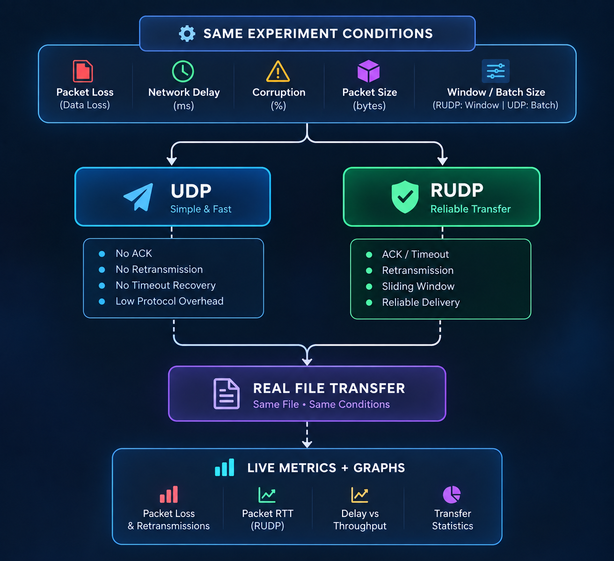
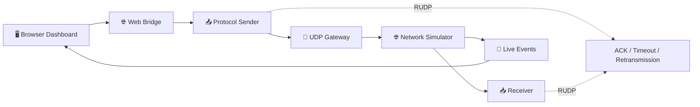
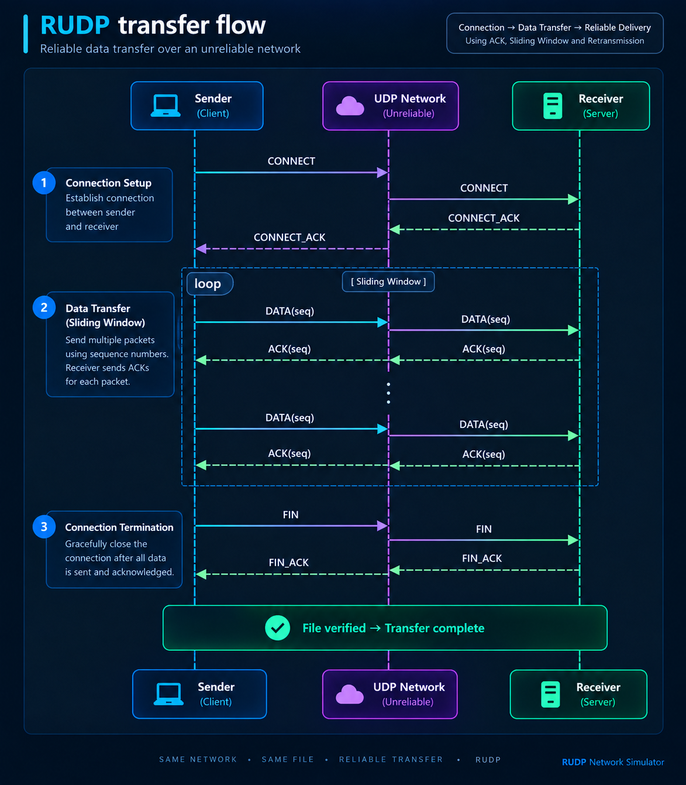
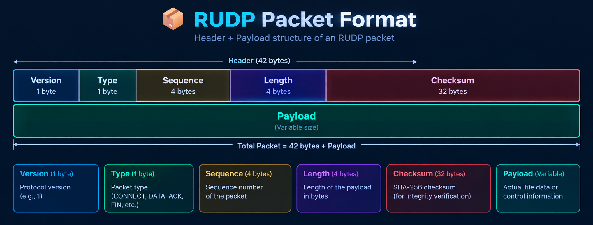
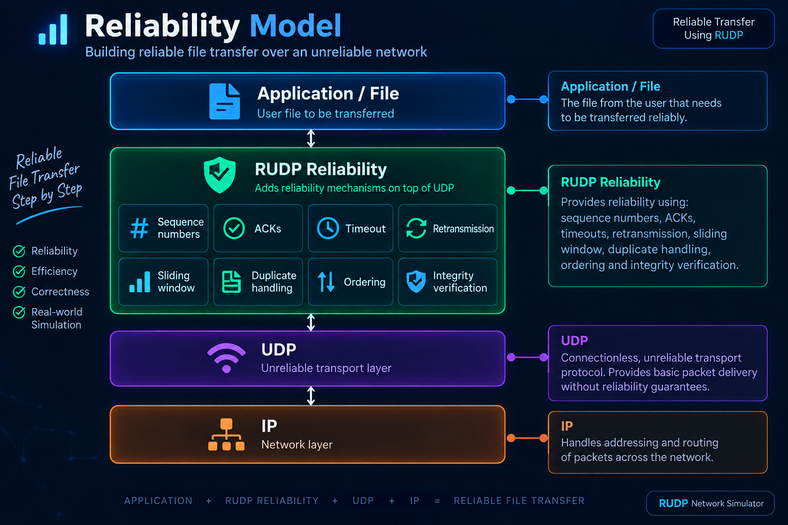
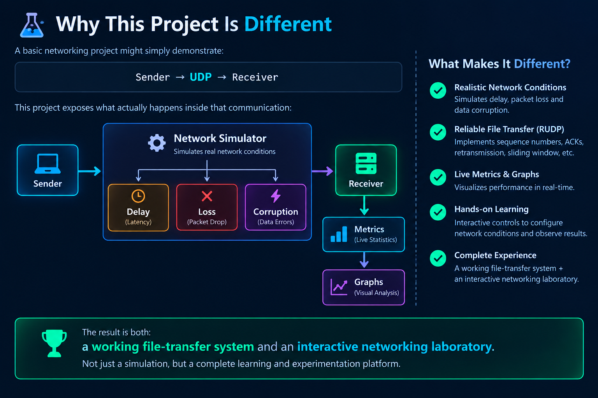

# 🚀 RUDP Network Simulator

### Reliable UDP Data Transfer & Graphical Network Simulation

> **Design and Implementation of a Reliable UDP-Based Data Transfer Protocol with Graphical Network Simulation**

<div align="center">


</div>

---

## 🎬 Project Overview

RUDP Network Simulator is a real file-transfer and network-experiment platform that makes packet-level networking behavior visible.

It implements a custom **Reliable UDP (RUDP)** protocol over UDP and provides a **plain UDP mode** for controlled comparison.

The simulator can introduce configurable:

- 📉 Packet loss
- ⏱️ Network delay
- 🧩 Packet corruption
- 📦 Packet-size changes
- 🔁 ACK loss for RUDP
- 🪟 Sliding-window behavior for RUDP
- 🚀 Send-batch behavior for UDP

The dashboard visualizes packet movement, acknowledgements, losses, retransmissions, RTT, throughput, and file-integrity results in real time.

---

## ✨ Core Concept

<p align="center">
  
</p>

**UDP prioritizes simplicity and low protocol overhead. RUDP adds reliability mechanisms above UDP.**

---

# 🌐 Architecture



### Runtime pipeline

```text
Browser
   │
   │ HTTP + SSE
   ▼
Web Bridge
   │
   ▼
Sender
   │
   ▼
UDP Gateway
   │
   ▼
Network Simulator
   ├── Delay
   ├── Packet Loss
   ├── Corruption
   └── Delivery
   │
   ▼
Receiver
   ├── Packet processing
   ├── File reconstruction
   ├── Size verification
   └── SHA-256 verification
```

---

# 🛡️ RUDP Reliability

RUDP provides reliability mechanisms above UDP:

- Sequence numbers
- ACKs
- ACK-loss simulation
- Timeout handling
- Retransmission
- Sliding window
- Duplicate detection
- Out-of-order handling
- Checksum verification
- File reassembly
- SHA-256 integrity verification

### RUDP transfer flow

<p align="center">
  
</p>

### Lost DATA packet

```text
Sender
  │
  ├── DATA #24 ─────────── X
  │                      LOST
  │
  │                     TIMEOUT
  │                        │
  │                        ▼
  ├── DATA #24 ───────────────► Receiver
  │                              │
  │                              ▼
  ◄──────────── ACK #24 ─────────┘
```

---

# 📦 RUDP Packet Format

<p align="center">
  
</p>

Binary header format:

```text
!BBII32s
```

### Packet types

| Type | Value | Purpose |
|---|---:|---|
| CONNECT | 1 | Start transfer session |
| CONNECT_ACK | 2 | Accept connection |
| DATA | 3 | Carry file data |
| ACK | 4 | Acknowledge DATA |
| NACK | 5 | Negative acknowledgement |
| FIN | 6 | End transfer |
| FIN_ACK | 7 | Confirm termination |
| ERROR | 8 | Report protocol error |

---

# ⚡ UDP vs RUDP

| Feature | UDP | RUDP |
|---|:---:|:---:|
| UDP transport | ✅ | ✅ |
| Packet loss possible | ✅ | ✅ |
| Network delay | ✅ | ✅ |
| Corruption simulation | ✅ | ✅ |
| ACK | ❌ | ✅ |
| ACK loss | ❌ | ✅ |
| Timeout recovery | ❌ | ✅ |
| Retransmission | ❌ | ✅ |
| Sliding-window reliability | ❌ | ✅ |
| Duplicate recovery | ❌ | ✅ |
| Reliable ordering | ❌ | ✅ |
| SHA-256 verification | ✅ | ✅ |
| Reliability guarantee | ❌ | Custom reliable layer |

### Important distinction

UDP does **not** automatically lose packets.

Instead:

> UDP does not guarantee delivery. If the network loses a packet, UDP has no built-in mechanism to recover it.

This simulator can intentionally introduce packet loss so the difference between UDP and RUDP can be observed experimentally.

---

# 🎛️ Experiment Controls

| Control | UDP | RUDP |
|---|:---:|:---:|
| Packet Loss | ✅ | ✅ |
| ACK Loss | N/A / Disabled | ✅ |
| Network Delay | ✅ | ✅ |
| Corruption | ✅ | ✅ |
| Packet Size | ✅ | ✅ |
| Send Batch Size | ✅ | — |
| Window Size | — | ✅ |

### Control behavior

**UDP**

```text
Packet Loss       → Enabled
ACK Loss          → Disabled / N/A
Network Delay     → Enabled
Corruption        → Enabled
Packet Size       → Enabled
Send Batch Size   → Enabled
```

**RUDP**

```text
Packet Loss       → Enabled
ACK Loss          → Enabled
Network Delay     → Enabled
Corruption        → Enabled
Packet Size       → Enabled
Window Size       → Enabled
```

The UDP send batch size is a **sending/batching parameter**, not a reliability mechanism.

---

# 📊 Live Metrics

The dashboard tracks real measurements such as:

- Packets sent
- Total transmissions
- Packets received
- Packets lost
- Retransmissions
- Corrupted packets
- Duplicate packets
- ACKs received
- ACKs lost
- RTT
- Throughput
- Transfer time
- File size
- File integrity
- Experiment history

For plain UDP:

```text
ACKs            = 0
ACK loss        = N/A
Retransmissions = 0
RUDP RTT        = N/A
```

No fake reliability metrics are generated.

---

# 📈 Graphical Analysis

The dashboard contains exactly **three main graphs**.

## 1. Packet Loss & Retransmissions

Shows actual packet-loss behavior.

- UDP → packet loss
- RUDP → packet loss + retransmissions

UDP retransmissions remain **0** because UDP does not recover lost packets.

---

## 2. Packet RTT

RUDP RTT is measured from DATA transmission to its corresponding ACK.

```text
RUDP → Actual RTT measurements
UDP  → N/A
```

UDP does not use ACKs, so the simulator does not fabricate RUDP-style RTT measurements for UDP.

---

## 3. Delay vs Throughput

Each completed experiment creates one real observation:

```text
Configured Delay → Measured Throughput
```

Example:

```text
UDP   | 100 ms | actual throughput
RUDP  | 100 ms | actual throughput
UDP   | 200 ms | actual throughput
RUDP  | 200 ms | actual throughput
```

Experiment history records the protocol so UDP and RUDP results can be compared.

---

# 🧪 Recommended Experiment

Use identical conditions for a fair comparison.

### UDP

```text
Packet Loss     = 5%
ACK Loss        = N/A
Network Delay   = 100 ms
Corruption      = 0%
Packet Size     = 1024 bytes
Send Batch Size = 3
```

### RUDP

```text
Packet Loss     = 5%
ACK Loss        = 0%
Network Delay   = 100 ms
Corruption      = 0%
Packet Size     = 1024 bytes
Window Size     = 3
```

Keep the following identical:

```text
Same file
Same packet size
Same packet loss
Same network delay
Same corruption
```

Then observe:

```text
                    UDP                  RUDP
                     │                     │
                Packet loss          Packet loss
                     │                     │
                No recovery         Timeout + ACK
                     │                     │
              Possible loss         Retransmission
                     │                     │
                Final result         Final result
                     │                     │
                     └──────────┬──────────┘
                                ▼
                         Compare results
```

---

# 🔐 File Integrity

The simulator distinguishes between:

**Transfer completion**

and

**Successful file reconstruction + integrity verification**

A lost or corrupted UDP packet must not be hidden.

Possible result:

```text
Protocol          : UDP
Packets Sent      : 1000
Packets Received  : 951
Packets Lost      : 49
Retransmissions   : 0
Integrity         : FAILED
```

A successful RUDP experiment can recover lost DATA packets through retransmission and then verify the reconstructed file using SHA-256.

---

# 🗂️ Project Structure

```text
RUDP-Network-Simulator/
│
├── backend/
│   ├── sender.py
│   ├── web_bridge.py
│   │
│   ├── network/
│   │   ├── gateway.py
│   │   └── simulator.py
│   │
│   ├── receiver/
│   │   └── receiver.py
│   │
│   └── temp_uploads/
│
├── css/
│   ├── base/
│   ├── components/
│   └── pages/
│
├── js/
│   ├── core/
│   ├── modules/
│   └── ...
│
├── pages/
│
├── index.html
├── README.md
└── .gitignore
```

> Keep this section synchronized with the actual repository if the final folder structure changes.

---

# ⚙️ Installation

## Requirements

- Python 3.x
- Modern web browser
- Windows / Linux / macOS
- Local network access for LAN experiments

## Start the backend

```bash
python backend/web_bridge.py
```

The bridge serves the dashboard and live event stream.

Example:

```text
http://127.0.0.1:8000/
```

Open the printed address in your browser.

---

# ▶️ Running a Transfer

## RUDP

1. Select **RUDP**.
2. Select a file.
3. Set Packet Loss.
4. Set ACK Loss if required.
5. Set Network Delay.
6. Set Corruption if required.
7. Set Packet Size.
8. Set Window Size.
9. Start the transfer.
10. Observe packet animation.
11. Observe ACKs and retransmissions.
12. Check file integrity.
13. Review the graphs.

## UDP

1. Select **UDP**.
2. Select the same file.
3. Configure Packet Loss / Delay / Corruption.
4. ACK Loss becomes disabled / N/A.
5. Set Packet Size.
6. Set Send Batch Size.
7. Start the transfer.
8. Observe packet movement without ACKs.
9. Check the actual received result.
10. Review throughput and experiment history.

---

# 🧪 Testing Checklist

- [x] UDP communication
- [x] RUDP communication
- [x] Sequence numbers
- [x] ACK handling
- [x] Timeout handling
- [x] Retransmission
- [x] Sliding window
- [x] Packet ordering
- [x] Duplicate handling
- [x] Corruption detection
- [x] File splitting
- [x] File reconstruction
- [x] SHA-256 verification
- [x] Network delay simulation
- [x] Packet-loss simulation
- [x] ACK-loss simulation
- [x] Live network events
- [x] Real file transfer
- [x] Performance metrics
- [x] Three graphical analyses
- [x] UDP vs RUDP experimental mode

---

# 🎥 Demo / Screenshots


<p align="center">
  
</p>
<p align="center">
  
</p>

---

# 🎯 Objectives

1. Design a custom reliable data-transfer protocol over UDP.
2. Understand UDP datagram communication.
3. Implement sequence-based DATA transfer.
4. Implement ACK-based reliability.
5. Implement timeout and retransmission.
6. Implement sliding-window communication.
7. Detect corrupted data.
8. Handle duplicates and packet ordering.
9. Transfer real files.
10. Simulate network conditions.
11. Visualize packet-level behavior.
12. Measure RTT and throughput.
13. Compare UDP and RUDP experimentally.

---

# 🧠 Learning Outcomes

This project demonstrates practical understanding of:

- Computer Networks
- UDP sockets
- Client-server communication
- Reliable data transfer
- Sliding-window protocols
- Acknowledgement mechanisms
- Timeout and retransmission
- Packet loss
- Network delay
- Data corruption
- Checksums
- File segmentation
- File reassembly
- SHA-256 integrity verification
- HTTP
- Server-Sent Events
- Real-time visualization
- Performance measurement
- Experimental networking

---

# 🏗️ Reliability Model

<p align="center">
  
</p>

---

# 🔬 Why This Project Is Different

<p align="center">
  
</p>

---

# 🚧 Future Enhancements

Possible future work:

- Adaptive retransmission timeout
- Congestion-control experiments
- Selective acknowledgement visualization
- Configurable network topologies
- Multi-client experiments
- Packet-capture export
- CSV experiment reports
- Automated benchmark runs
- Larger-scale LAN experiments
- Statistical performance analysis

---

# ⚠️ Technical Note

This is an **educational and experimental implementation** of a reliable protocol over UDP.

RUDP is a custom protocol designed to demonstrate reliable data transfer concepts. It should not be presented as a production replacement for TCP or other established transport protocols.

The purpose is to make transport-layer reliability mechanisms understandable, measurable, and visually observable.

---

# 👨‍💻 Academic Project

**Project Title**

> Design and Implementation of a Reliable UDP-Based Data Transfer Protocol with Graphical Network Simulation

**Program**

> MSc Computer Science

**Technology**

```text
Frontend
├── HTML5
├── CSS3
└── Vanilla JavaScript

Backend
└── Python

Transport
└── UDP

Integrity
└── SHA-256

Live Communication
├── HTTP
└── Server-Sent Events (SSE)
```

---

<div align="center">

## 🚀 RUDP Network Simulator

**Real File Transfer • Network Simulation • Reliability • Visualization • UDP vs RUDP**

<br>

**Make packets visible.  
Make reliability measurable.  
Make networking understandable.**

</div>
